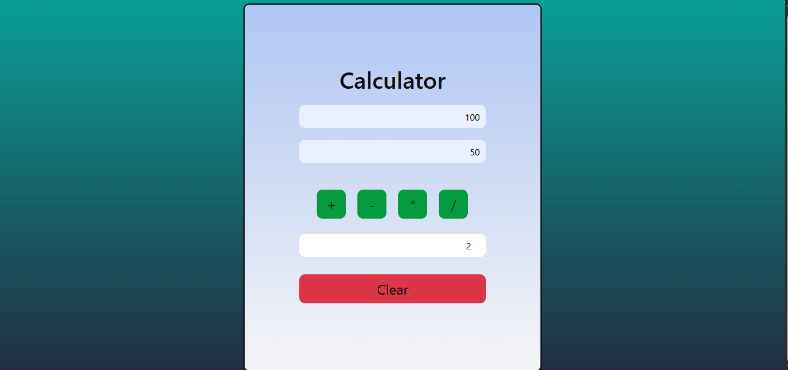

Link is here: https://basic-calculator-js-project.vercel.app/

1. Calculator

2. Addition

3. Substraction

4. Multiplication

5. Divison

///// Documantation /////

Structure
1. HTML Boilerplate
<!DOCTYPE html>: Declares the document type.
<html lang="en">: Sets the language to English.

2. <head> Section
<meta charset="UTF-8">: Sets character encoding.
<meta name="viewport" content="width=device-width, initial-scale=1.0">: Ensures responsive design on mobile devices.
<title>Calculator</title>: Sets the page title.
Bootstrap CSS is included via CDN for styling.
style.css is linked for custom styles.

3. <body> Section
Main Container

: Bootstrap container, centers content, adds top margin.
Header
<h2 class="header">Calculator</h2>: Title of the calculator.
Input Fields

: Contains two input fields for numbers.
<input type="text" id="num1" ...>: First number input.
<input type="text" id="num2" ...>: Second number input.
Operation Buttons

: Contains four buttons for arithmetic operations.
Each button has a unique id and an onclick attribute that calls a JavaScript function:
sum() for addition (+)
sub() for subtraction (-)
multi() for multiplication (*)
div() for division (/)
Result Display

: Contains the result field.
<input type="number" id="result" ... readonly>: Displays the result, read-only.
Clear Button
<button class="clear-btn bg-danger" onclick="clears()">Clear</button>: Clears all input and result fields.

4. Scripts
Bootstrap JS is included via CDN.
script.js is included for calculator logic (not shown in this file).
IDs and Classes
IDs:
num1, num2: Input fields for numbers.
addition, subtract, multiple, divison: Operation buttons.
result: Output field.

Classes:
container, text-center, mt-3, mb-3, d-flex, align-items-center, justify-content-center, btn, input, clear-btn, bg-danger: Bootstrap and custom classes for layout and styling.
Expected JavaScript Functions
sum(): Adds the two numbers.
sub(): Subtracts the second number from the first.
multi(): Multiplies the two numbers.
div(): Divides the first number by the second.
clears(): Clears all input and result fields.

Usage
Enter two numbers in the input fields.
Click an operation button to calculate and display the result.
Click "Clear" to reset all fields.
Dependencies
Bootstrap 5.3.6
style.css (custom styles)
script.js (calculator logic)
